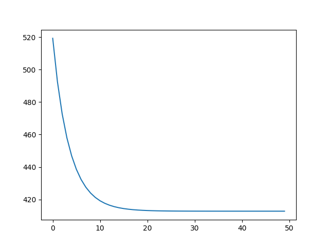
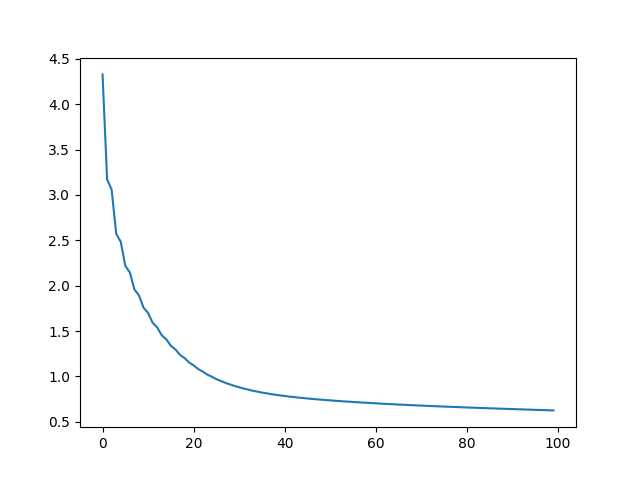
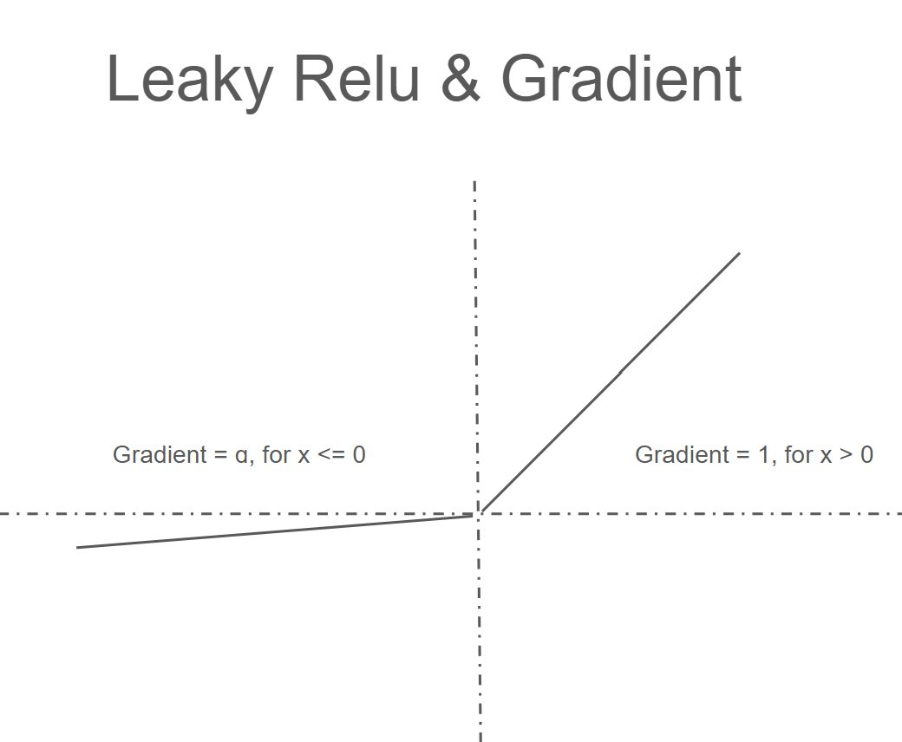
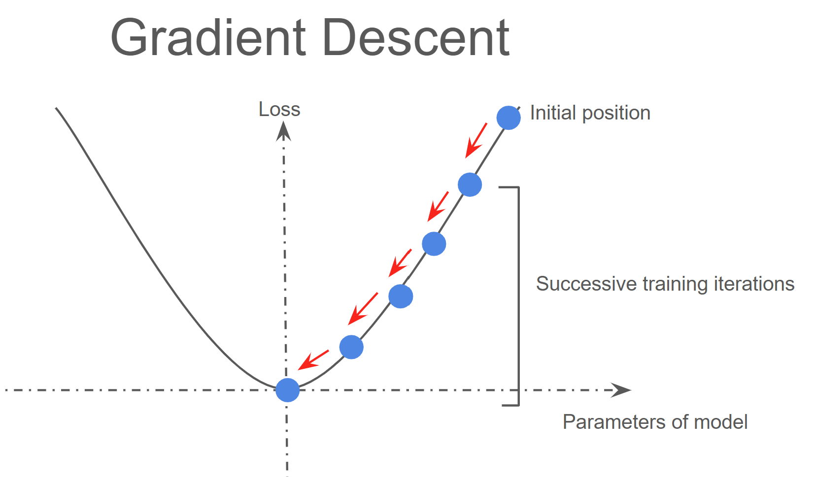

# neural-net-in-cxx
This is an implementation of neural network architecture in c++, designed to predict housing prices from the [California housing dataset](https://scikit-learn.org/dev/modules/generated/sklearn.datasets.fetch_california_housing.html). The model uses He weight initialisation, leaky-relu activation for all layers except for the output layer, batch gradient descent, and MSE loss. Feature vectors are standardised before being passed into the network.

Additionally included in the discussion below, as well as in [pytorch_implementation.py](pytorch_implementation.py), is an implementation of a neural network in pytorch also trained on the [California housing dataset](https://scikit-learn.org/dev/modules/generated/sklearn.datasets.fetch_california_housing.html). This will serve as a touchstone to compare the effectiveness of my neural-net implementation against.

## Files/Folders
1) pytorch_implementation.py - contains a neural network implemented using pytorch
2) C++ implementation - contains all relevant files to my implementation of a neural network in c++.
3) input.txt is the input file containing data from the California housing dataset - used as input for the c++ implementation (input taken in main.cpp)
4) Output: contains outputs from both the python and cpp implementations.
    a) "cpp: predicted vs actual.txt": contains input value (x), output of the model (predicted) and target (y), ascertained in final epoch of training.
    b) cpp_errors_per_epoch.txt: essentially the output generapted by main.cpp (in the c++ implementation folder). Contains a list of train and test errors (model was not trained on the test data set) for each epoch.
   c) python output: contains the output of python_implementation.py - essentially the test and train loss per epoch
5) Graphs - a folder containing graphs generated from matplotlib.pyplot that contain error vs epoch curves for both the pytorch and c++ implementations of the neural network.
6) README_images: images I have made to assist my explanations throughout the rest of this article
7) Proof of competency: I did not want to obtain the formulas for forward propagation and backpropagation online, I wanted to derive them. This folder has my rough working of me succesfully deriving these formulas. Contains mostly scribbles of linear algebra. Ignore how I have used an old diary as scrap paper, the workings were done in the past month (November 2024).
8) The article you are currently reading.

## How to compile my c++ code
Download the "C++ implementation" folder and migrate into it via command prompt. Run the following command to compile: (note: using gcc compiler)
```
g++ main.cpp optimiser.cpp matrix.cpp neuralnet.cpp
```
Then the following command to run (you will have to download and move input.txt into the same folder): 
```
a.exe < input.txt > output.txt
```

## Results
Here is the epoch-loss graph for the pytorch implementation:  

and from my cpp implementation: 



We can see that the y axis has a different scale - at the moment I believe this is due to using a different divisor in my implementation of mse loss. Looking at "Output/cpp: predicted vs actual.txt" we see that the model does a decent job at estimating housing prices. Because my network successfully improves with more training, I am happy to say that my c++ neural network implementation is a success!

# An explanation of my neural network implementation
a.k.a an explanation of the theory behind gradient descent

## What is a neural network
A neural network is a sequence of layers - this can be thought of as a sequetially applied mathematical functions that maps a vector input $a$ of $i$ dimension ($a \in \mathbb{R}^i$, $a$ being a row vector) and applies matrix transformation producing an output vector $b$ of $o$ dimension ($b \in \mathbb{R}^o$, $b$ being a row vector). Each layer will apply the following transformation: 
```math
b = w \cdot a + b
```
where $w$ (our weights) is a matrix of dimensions $a$ x $b$ , and b (our biases) is a vector of dimension $b$, and $w \cdot a$ is the dot product of $w$ and $a$. This is a linear transformation. Note: I have implemented the naive approach to matrix dot products - I am aware of optimisations that could be made, but have ultimately decided they would not contribute much to the goal of this project.

To allow for non-linear mappings between inputs and outputs of each layer, we apply an activation function at each layer (some non-linear transformation of the data after each linear transformation). I have chosen the leaky-ReLU (leaky rectified linear unit function). This builds upon the ReLU activation. This is defined as 
```math
ReLU(x) = max(x, 0) = \frac{x + |x|}{2}
```
which prevents any negative values from being passed forwards. ReLU activaions can potentially lead to dead neurons: neurons that will never fire due to learning large negative biases. Instead of returning 0 for a negative input $X$, leaky-Rely instead returns $\alpha X$ where $\alpha$ is some coefficient that we define. 



By stacking these layers we create a mathematical function mapping between the dependant variable $X$ of some dimensions, to the vector space of our desired output $Y$. Note, I simply use a linear activation function for my final layer as this is what is typically deemed appropriate for regression problems. 

## How do we train neural networks so they can better model the relationship between X (inputs) and Y (outputs) 
We train our neural networks in order to optimise a cost function. I use the mean squared error loss defined as:
```math
\frac{1}{2n} \Sigma_{i=1}^n (\hat{y}_i - y_i)^2
```
note the 2 on the denominator which simplifies finding the gradient as described below.
By optimising this with respects to the weights and biases in our neural network, we minimise our cost function and thus hope to improve the accuracy of our model. Unlike linear regression, this optimisation problem does not have a closed form solution - so we use a process called gradient descent.

Gradient descent involves calculating the gradient of our loss with respect to each weight and bias in our model. This gradient represents the steepest incline at the state the model is currently in. By subtracting the respective gradient from each weight, we are moving down the gradient (i.e. down the curve - see below diagram) and moving to the point of lowest cost. We move down this graient at a rate called the "learning rate" which is a user defined parameter similar to the $\alpha$ of the leeky-ReLU. The learning rate controls how fast we approach our minima, if too large we may jump over our minima to the other side of the curve.



Because our neural network is essentialy a series of composed functions of such as: 
```math
w_n\cdot ReLU(w_{n-1} \cdot X + b_{n-1}) + b_n
```
where $w_n$ and $b_n$ are the respective weights and biases for layer $n$, we can compute the gradient at any point by using the chain rule. For example we take the derivative of the loss with respect to the output of any layer. 
Then the gradient of our loss with respect to the weights of that layer $i$ is:

```math
\begin{aligned}
\frac{d \text{ Loss wrt this layer output}}{w_i} &= \frac{d(w_ix+b_i)}{d w_i} \cdot \frac{d \text{ LeakyReLU}(w_ix+b_i)}{d(w_ix+b_i)} \cdot d \text{ Loss wrt this layers output}\\
&= x^T \cdot [1 \text{ if } x>0 \text{, or } \alpha \text{ if } x<0] \cdot d \text{ Loss wrt this layers output}
\end{aligned}
```
```math
\begin{aligned}
\frac{d \text{ Loss wrt this layers output}}{w_i} &= \frac{d(w_ix+b_i)}{d b_i} \cdot \frac{d \text{ LeakyReLU}(w_ix+b_i)}{d(w_ix+b_i)} \cdot d \text{ Loss wrt this layers output}\\
&= 1 \cdot [1 \text{ if } x>0 \text{, or } \alpha \text{ if } x<0] \cdot d \text{ Loss of this layer}
\end{aligned}
```
---
Then, as the output of the previous layer is the input for this layer ($X$ in the above equations) we get the loss for the previous layers output:
```math
\begin{aligned}
\frac{d \text{Loss}}{\text{previous layers output}}
&= \frac{d(w_ix+b_i)}{d X} \cdot \frac{d \text{ LeakyReLU}(w_ix+b_i)}{d(w_ix+b_i)} \cdot d \text{ Loss wrt this layers output}\\
&= [1 \text{ if } x>0 \text{, or } \alpha \text{ if } x<0] \cdot d \text{ Loss wrt this layers output} \cdot w_i^T
\end{aligned}
```

---

Of course for the final layer, we do not have a leakyReLU activation - so this is removed from our equation
```math
\frac{d Loss}{w_n} = \frac{d(w_nx+b_n)}{d w_n} \cdot \frac{d Loss}{d w_nx+b_n}
= x^T \cdot (\hat{y} - y)
```
```math
\frac{d Loss}{b_n} = \frac{d(w_nx+b_n)}{d b_n} \cdot \frac{d Loss}{d (w_nx+b_n)}
= 1 \cdot (\hat{y} - y)
```
```math
\begin{aligned}
\frac{d Loss}{d \text{previous layers output}} &= \frac{d \text{Loss wrt this layers output}}{d x} \\
&= \frac{d Loss}{d w_nx+b_n} \cdot \frac{d(w_nx+b_n)}{d X} \\
&= (\hat{y} - y) \cdot w_n^T
\end{aligned}
```


Note: the above equations only calculate the gradient for 1 instance of data. We must use the mean gradient across all instances of data in our batch for batch-gradient descent. In implementation, we will start by computing the gradients for biases and weights of the final layer. Then compute the gradient of the loss compared to the output of the previous layer, and move backwards. Hence the name: backpropagation.

## Weight initialisation
There are some issues with the gradient descent model. You can imaging, that if we are traversing down the gradient, we may converge onto a local minima rather than the global minima, thus leading to less-than-optimal model. There are many methods for setting the initial wights of the model to help reduce the likelihood of this. I use the He method of initialisaiton, where each the weights of each layer are randomly sampled from a normal distribution with mean 0 and std $\sqrt{\frac{2}{n}}$ where $n$ is the number of inputs into the layer. This is reguarded good practice for Relu layers. 

## Data standardisation
Because the initial parameters of a model are randomly generated - there can be large instability in a models performance if the input data is not scaled appropriately. This means the model may perform very differently each time it is built and trained. For example, if the input values are very large, then the model will learn very large weights (which can lead to unstable behaviour, and potentially lead to integer overflows and NaN's in your weights). To protect against this, and to make our inputs unitless, I have standaridised each feature in the train input data (w.r.t. the rest of the train dataset) and the test input data (wrt to the test dataset). I used Welford's online algorithm to compute the standard deviation and mean - but this is out of the scope of this article so I will not elaborate on this. (Code is present in main.cpp).
